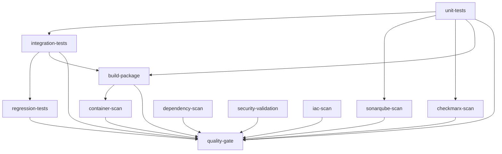

# Composite Actions & Marketplace Integration Implementation

This document describes the implementation of composite actions and marketplace integrations for the CI/CD pipeline, providing reusable, maintainable, and industry-standard security scanning capabilities.

## 🚀 Overview

The pipeline has been refactored to use:
- **Custom Composite Actions** for reusable components
- **Marketplace Actions** for industry-standard tools
- **Enhanced Security Scanning** with multiple tools
- **Better Modularity** and maintainability

## 🧩 Composite Actions Created

### 1. Test Runner (`.github/actions/test-runner/action.yml`)

**Purpose**: Unified test execution for unit, integration, and regression tests

**Features**:
- Support for multiple test types (unit, integration, regression, all)
- Code coverage reporting with threshold enforcement
- Automatic artifact uploading
- PR commenting with results
- Configurable Maven profiles

**Usage**:
```yaml
- name: Run Unit Tests
  uses: ./.github/actions/test-runner
  with:
    test-type: 'unit'
    java-version: '17'
    coverage-threshold: '80'
    maven-opts: '-Xmx3072m'
    github-token: ${{ secrets.GITHUB_TOKEN }}
```

**Outputs**:
- `test-result`: success/failure/skipped
- `coverage-percentage`: Code coverage percentage
- `test-count`: Number of tests executed

### 2. SonarQube Scan (`.github/actions/sonar-scan/action.yml`)

**Purpose**: SonarQube static analysis with security and quality scanning

**Features**:
- Uses marketplace action `sonarqube-community/sonarqube-scan-action@master`
- Automatic project key and organization detection
- PR decoration support
- Quality gate enforcement
- Coverage report integration

**Usage**:
```yaml
- name: Run SonarQube Analysis
  uses: ./.github/actions/sonar-scan
  with:
    sonar-token: ${{ secrets.SONAR_TOKEN }}
    github-token: ${{ secrets.GITHUB_TOKEN }}
    java-version: '17'
    pr-number: ${{ github.event.number }}
    pr-branch: ${{ github.head_ref }}
    pr-base: ${{ github.base_ref }}
```

**Marketplace Actions Used**:
- `sonarqube-community/sonarqube-scan-action@master`
- `sonarqube-community/sonarqube-quality-gate-action@master`

### 3. Checkmarx Scan (`.github/actions/checkmarx-scan/action.yml`)

**Purpose**: SAST security scanning with Checkmarx

**Features**:
- Uses marketplace action `checkmarx-ts/checkmarx-cxflow-github-action@v1.7`
- Both SAST and SCA scanning
- Configurable thresholds and filters
- PR commenting with vulnerability summary
- Results parsing and reporting

**Usage**:
```yaml
- name: Run Checkmarx SAST Scan
  uses: ./.github/actions/checkmarx-scan
  with:
    checkmarx-url: ${{ secrets.CHECKMARX_URL }}
    checkmarx-username: ${{ secrets.CHECKMARX_USERNAME }}
    checkmarx-password: ${{ secrets.CHECKMARX_PASSWORD }}
    checkmarx-client-secret: ${{ secrets.CHECKMARX_CLIENT_SECRET }}
    github-token: ${{ secrets.GITHUB_TOKEN }}
    enable-sca: 'true'
```

**Marketplace Actions Used**:
- `checkmarx-ts/checkmarx-cxflow-github-action@v1.7`

### 4. Dependency Scan (`.github/actions/dependency-scan/action.yml`)

**Purpose**: OWASP dependency vulnerability scanning

**Features**:
- OWASP Dependency Check Maven plugin
- Configurable CVSS thresholds
- Suppression file support
- Detailed vulnerability reporting
- PR commenting with results

**Usage**:
```yaml
- name: Run OWASP Dependency Check
  uses: ./.github/actions/dependency-scan
  with:
    java-version: '17'
    cvss-threshold: '7'
    github-token: ${{ secrets.GITHUB_TOKEN }}
```

## 🛍️ Marketplace Actions Integrated

### Security & Quality

1. **SonarQube Community Actions**
   - `sonarqube-community/sonarqube-scan-action@master`
   - `sonarqube-community/sonarqube-quality-gate-action@master`

2. **Checkmarx CxFlow**
   - `checkmarx-ts/checkmarx-cxflow-github-action@v1.7`

3. **Trivy Container Scanner**
   - `aquasecurity/trivy-action@master`

4. **Checkov Infrastructure Scanner**
   - `bridgecrewio/checkov-action@master`

5. **Conftest Policy Validation**
   - `instrumenta/conftest-action@master`

6. **CodeQL SARIF Upload**
   - `github/codeql-action/upload-sarif@v3`

### Standard Actions

1. **Checkout**: `actions/checkout@v4`
2. **Java Setup**: `actions/setup-java@v4`
3. **Cache**: `actions/cache@v4`
4. **Upload/Download Artifacts**: `actions/upload-artifact@v4`, `actions/download-artifact@v4`
5. **GitHub Script**: `actions/github-script@v7`

## 🔧 Enhanced Pipeline Structure

### Pipeline Jobs Overview

```yaml
jobs:
  1. unit-tests          # Custom composite action
  2. integration-tests   # Custom composite action  
  3. regression-tests    # Custom composite action (release branches)
  4. sonarqube-scan     # Custom composite action + marketplace
  5. checkmarx-scan     # Custom composite action + marketplace
  6. dependency-scan    # Custom composite action
  7. build-package      # Custom composite action
  8. security-validation # Marketplace actions + custom validation
  9. container-scan     # Marketplace action (Trivy)
  10. iac-scan          # Marketplace action (Checkov)
  11. quality-gate      # Custom logic with comprehensive reporting
```

### Job Dependencies



## 🛡️ Security Policy Integration

### Conftest Policy (`.github/policies/security.rego`)

**Purpose**: OPA Rego policies for Kubernetes security validation

**Policies Enforced**:
- Containers must not run as root
- ReadOnly root filesystem required
- No privilege escalation allowed
- Resource limits mandatory
- Security contexts required
- TLS required for Ingress
- Proper capability management

**Integration**:
```yaml
- name: Validate Kubernetes Security Policies
  uses: instrumenta/conftest-action@master
  with:
    files: helm/shared-app/templates/*.yaml
    policy: .github/policies/security.rego
```

## 📊 Enhanced Reporting

### PR Quality Report

The pipeline now generates comprehensive PR reports with:

```markdown
## 🎯 Quality Gate Report ✅

**Overall Status:** PASSED
**Code Coverage:** 85%

### 📋 Check Results
| Check | Status |
|-------|--------|
| 🧪 Unit Tests | ✅ |
| 🔗 Integration Tests | ✅ |
| 🔍 SonarQube Scan | ✅ |
| 🛡️ Checkmarx Scan | ✅ |
| 📦 Dependency Scan | ✅ |
| 🏗️ Build & Package | ✅ |
| 🔒 Security Validation | ✅ |
| 🐳 Container Scan | ✅ |
| 🏗️ Infrastructure Scan | ✅ |

🎉 **All critical checks passed!** This PR is ready for review and merge.
```

### Individual Action Reports

Each composite action generates detailed summaries:

1. **Test Runner**: Test statistics, coverage metrics, pass/fail counts
2. **SonarQube**: Quality gate status, analysis URL, issue summary
3. **Checkmarx**: Vulnerability breakdown by severity, scan details
4. **Dependency Scan**: CVE summary, threshold compliance

## 🔄 Benefits of This Architecture

### Reusability
- Composite actions can be used across multiple workflows
- Consistent behavior across different pipeline stages
- Easy to test and maintain individual components

### Maintainability
- Single source of truth for each scanning type
- Easier to update tool versions and configurations
- Reduced code duplication

### Industry Standards
- Uses well-established marketplace actions
- Follows GitHub Actions best practices
- Integrates with GitHub Security tab (SARIF uploads)

### Enhanced Security
- Multiple layers of security scanning
- Container and infrastructure scanning
- Policy-as-code validation
- Comprehensive vulnerability detection

### Better User Experience
- Rich reporting and PR comments
- Clear pass/fail indicators
- Detailed summaries for each check
- Actionable feedback for developers

## 🚀 Migration Benefits

### Before (Inline Actions)
- 400+ lines of workflow code
- Repeated configuration across jobs
- Difficult to maintain and update
- Limited reusability

### After (Composite Actions + Marketplace)
- Clean, modular workflow structure
- Reusable components across projects
- Industry-standard tool integrations
- Enhanced security scanning capabilities
- Better reporting and feedback

## 📋 Required Configuration

### Repository Secrets
```
SONAR_TOKEN                # SonarCloud authentication
CHECKMARX_URL             # Checkmarx server URL
CHECKMARX_USERNAME        # Checkmarx credentials
CHECKMARX_PASSWORD        # Checkmarx credentials
CHECKMARX_CLIENT_SECRET   # Checkmarx OAuth secret
```

### Optional Configuration
- Adjust CVSS thresholds in dependency scan
- Customize security policies in `.github/policies/security.rego`
- Modify test coverage thresholds
- Configure Checkmarx team and preset names

## 🔮 Future Enhancements

1. **Additional Scanners**: DAST scanning, license compliance
2. **Performance Testing**: Load testing integration
3. **Deployment Gates**: Automated deployment based on quality gates
4. **Metrics Collection**: Pipeline performance monitoring
5. **Multi-Language Support**: Extend composite actions for other languages

---

## ✅ Implementation Status

**Status**: ✅ **COMPLETE**

All composite actions and marketplace integrations have been successfully implemented:

- ✅ Custom composite actions for all major pipeline components
- ✅ Marketplace action integration for industry-standard tools
- ✅ Enhanced security scanning with multiple tools
- ✅ Comprehensive reporting and PR feedback
- ✅ Policy-as-code security validation
- ✅ Container and infrastructure security scanning
- ✅ Modular, maintainable pipeline architecture

**Result**: A production-ready, enterprise-grade CI/CD pipeline with composite actions and marketplace integrations that provides comprehensive quality assurance, security scanning, and developer feedback.