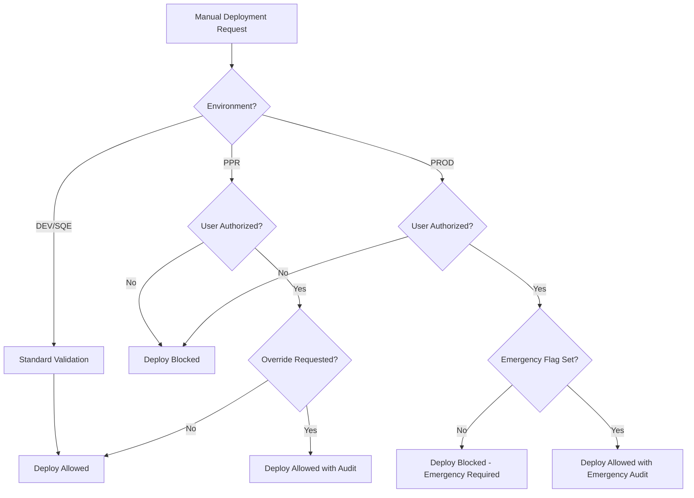

# Deployment Security Guide

This document explains the comprehensive security mechanisms implemented to protect production environments while maintaining deployment flexibility.

## 🛡️ Security Overview

The deployment system implements multi-layered protection for production environments:

- **Lower Environments (DEV, SQE)**: Standard validation with branch-based rules
- **Protected Environments (PPR, PROD)**: Enhanced protection with role-based access control
- **Emergency Deployments**: Strict authorization requirements with full audit trail

## 🔒 Protection Levels

### Level 1: Development & SQE (Standard Protection)
- **Environments**: `dev`, `sqe`
- **Protection**: Branch validation only
- **Manual Override**: Available to all users
- **Use Case**: Development and testing workflows

### Level 2: Pre-Production (Enhanced Protection)
- **Environment**: `ppr`
- **Protection**: Role-based access control for manual overrides
- **Authorization**: Requires authorized user for branch validation override
- **Use Case**: Final validation before production

### Level 3: Production (Maximum Protection)
- **Environment**: `prod`
- **Protection**: Role-based access + emergency flag requirement
- **Authorization**: Requires authorized user + emergency deployment flag
- **Use Case**: Live production deployments with maximum security

## 👥 Authorization System

### Authorized Users Configuration

The system maintains a configurable list of authorized users for protected environments:

```bash
# In shared workflow - easily configurable
AUTHORIZED_USERS="admin,devops-lead,release-manager,platform-engineer"
```

### User Authorization Levels

| User Role | DEV/SQE | PPR Override | PROD Override | Emergency PROD |
|-----------|---------|--------------|---------------|----------------|
| **Developer** | ✅ | ❌ | ❌ | ❌ |
| **DevOps Lead** | ✅ | ✅ | ✅ | ✅ |
| **Release Manager** | ✅ | ✅ | ✅ | ✅ |
| **Platform Engineer** | ✅ | ✅ | ✅ | ✅ |
| **Admin** | ✅ | ✅ | ✅ | ✅ |

## 🚨 Protection Scenarios

### Scenario 1: Developer Attempts Unauthorized PPR Deployment

```bash
# Developer tries to deploy to PPR with override
gh workflow run deploy.yml \
  -f environment=ppr \
  -f override_branch_validation=true

# Result: ❌ BLOCKED
# Message: "User 'developer-username' is not authorized for PPR deployments"
```

### Scenario 2: Developer Attempts Unauthorized PROD Deployment

```bash
# Developer tries to deploy to PROD with override
gh workflow run deploy.yml \
  -f environment=prod \
  -f override_branch_validation=true

# Result: ❌ BLOCKED
# Message: "User 'developer-username' is not authorized for PROD deployments"
```

### Scenario 3: Authorized User PPR Deployment

```bash
# DevOps lead deploys to PPR with override
gh workflow run deploy.yml \
  -f environment=ppr \
  -f override_branch_validation=true \
  -f deploy_notes="Testing hotfix before production"

# Result: ✅ APPROVED
# Message: "Pre-Prod deployment approved: authorized manual override"
```

### Scenario 4: Authorized User Emergency PROD Deployment

```bash
# DevOps lead attempts PROD deployment without emergency flag
gh workflow run deploy.yml \
  -f environment=prod \
  -f override_branch_validation=true

# Result: ❌ BLOCKED
# Message: "Emergency deployment flag required for PROD manual override"

# DevOps lead with proper emergency deployment
gh workflow run deploy.yml \
  -f environment=prod \
  -f override_branch_validation=true \
  -f emergency_deployment=true \
  -f deploy_notes="Critical security patch"

# Result: ✅ APPROVED
# Message: "Production deployment approved: EMERGENCY authorized manual override"
# Audit: "🚨 EMERGENCY DEPLOYMENT: User=devops-lead, Notes='Critical security patch'"
```

## 🔐 Manual Deployment Security Matrix

### Workflow Dispatch Parameters

| Parameter | DEV/SQE | PPR | PROD | Security Impact |
|-----------|---------|-----|------|----------------|
| `environment` | Any user | Any user | Any user | Selection only |
| `override_branch_validation` | Any user | **Authorized only** | **Authorized only** | Branch bypass |
| `emergency_deployment` | N/A | N/A | **Required** | Emergency flag |
| `custom_image_tag` | Any user | Authorized | Authorized | Version control |
| `deploy_notes` | Any user | Recommended | **Required** | Audit trail |

### Protection Validation Flow



## 🔍 Audit Trail

### Security Event Logging

The system logs all security-relevant events:

#### User Authorization Checks
```bash
"🔒 Validating protected environment deployment: PPR"
"✅ Protected deployment authorized for user 'devops-lead'"
"❌ User 'developer' is not authorized for PPR deployments"
```

#### Emergency Deployment Tracking
```bash
"🚨 EMERGENCY DEPLOYMENT: User=devops-lead, Notes='Critical security patch'"
"✅ Production deployment approved: EMERGENCY authorized manual override"
```

#### Branch Override Events
```bash
"✅ Pre-Prod deployment approved: authorized manual override from branch feature/hotfix"
"❌ Production deployment blocked: must be tag or authorized emergency manual override"
```

## ⚙️ Configuration Management

### Adding Authorized Users

To add a new authorized user for protected environments:

```bash
# In .github/workflows/shared-deploy.yml
AUTHORIZED_USERS="admin,devops-lead,release-manager,platform-engineer,new-user"
```

### Customizing Protection Levels

The protection system can be customized per organization:

```bash
# Example: Different authorization for different environments
validate_protected_deployment() {
  local env="$1"
  local requires_emergency="$2"
  
  case "$env" in
    "PPR")
      # PPR-specific authorization logic
      ;;
    "PROD")
      # PROD-specific authorization logic
      ;;
  esac
}
```

## 🚀 Best Practices

### For Developers
1. **Use automatic deployment** for normal workflows (branch-based)
2. **Request authorized users** for manual overrides to protected environments
3. **Document deployment reasons** in deploy_notes for audit purposes
4. **Never attempt** unauthorized production deployments

### For DevOps/Release Managers
1. **Verify deployment necessity** before using overrides
2. **Use emergency flag judiciously** - only for actual emergencies
3. **Provide detailed notes** for all manual deployments
4. **Monitor audit logs** for unauthorized attempts
5. **Review and update** authorized user list regularly

### For Platform Engineers
1. **Regularly review** authorization configurations
2. **Monitor security events** in deployment logs
3. **Update protection mechanisms** based on organizational needs
4. **Conduct security reviews** of deployment practices

## 🛠️ Emergency Procedures

### Emergency Production Deployment Process

1. **Assess Situation**: Confirm genuine emergency requiring immediate deployment
2. **Verify Authorization**: Ensure user is in authorized list
3. **Execute Deployment**:
   ```bash
   gh workflow run deploy.yml \
     -f environment=prod \
     -f override_branch_validation=true \
     -f emergency_deployment=true \
     -f custom_image_tag=emergency-hotfix-v1.2.1 \
     -f deploy_notes="[EMERGENCY] Critical security vulnerability fix - CVE-2024-XXXX"
   ```
4. **Post-Deployment**: Document incident and review process

### Emergency Response Checklist

- [ ] Emergency situation confirmed
- [ ] Authorized user performing deployment
- [ ] Emergency flag set to true
- [ ] Detailed deployment notes provided
- [ ] Custom image tag specified (if needed)
- [ ] Post-deployment validation planned
- [ ] Incident documentation prepared

## 🔧 Troubleshooting

### Common Authorization Issues

#### "User not authorized" Error
```bash
# Check authorized users list
grep "AUTHORIZED_USERS" .github/workflows/shared-deploy.yml

# Add user to authorized list or request deployment from authorized user
```

#### "Emergency deployment flag required" Error
```bash
# For PROD manual override, emergency flag is required
gh workflow run deploy.yml \
  -f environment=prod \
  -f override_branch_validation=true \
  -f emergency_deployment=true  # <- Required for PROD override
```

#### Deployment Blocked Despite Authorization
```bash
# Check all required parameters for PROD deployment:
# 1. User must be authorized
# 2. Emergency flag must be true
# 3. Deploy notes should be provided
# 4. Override validation must be explicitly set
```

## 📊 Security Metrics

### Deployment Security Dashboard

Track these metrics for security monitoring:

- **Authorized Deployments**: Count of successful authorized deployments
- **Blocked Attempts**: Count of unauthorized deployment attempts
- **Emergency Deployments**: Count of emergency PROD deployments
- **User Activity**: Deployment activity by user
- **Environment Access**: Access patterns per environment

### Sample Security Report

```
Deployment Security Report (Last 30 Days)
==========================================
Total Deployment Attempts: 150
- DEV: 80 (100% success)
- SQE: 45 (100% success)
- PPR: 20 (95% success, 1 blocked unauthorized)
- PROD: 5 (100% success, 3 emergency)

Blocked Attempts: 1
- PPR unauthorized override: developer-user-123

Emergency Deployments: 3
- All properly authorized and documented
- Average resolution time: 15 minutes
```

## ✅ Summary

The deployment security system provides:

- **🛡️ Multi-layered Protection**: Different security levels per environment
- **👥 Role-based Access Control**: Configurable authorized user management
- **🚨 Emergency Procedures**: Controlled emergency deployment capability
- **📝 Complete Audit Trail**: Full logging of all security events
- **⚙️ Flexible Configuration**: Adaptable to organizational needs
- **🔒 Production Safety**: Maximum protection for production environments

This ensures that while developers have flexibility for normal deployments, production environments remain protected against accidental or unauthorized deployments.