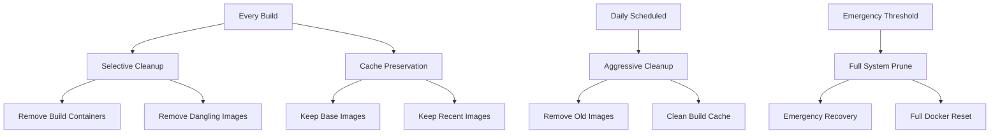

# Docker Cleanup Strategy for CI/CD Runners

## 🎯 **Executive Summary**

This document outlines a comprehensive Docker cleanup strategy for GitHub Actions runners that balances:
- **🚀 Build Speed**: Preserving useful Docker layers and caches
- **💾 Disk Usage**: Preventing disk space exhaustion
- **⚡ Operational Efficiency**: Automated cleanup with minimal maintenance overhead
- **🔧 Performance**: Strategic caching to reduce image rebuild times

## 📊 **Recommended Balanced Approach**

### **🥇 Primary Strategy: Multi-Level Cleanup**



## 🔧 **Implementation Strategy**

### **1. 🚀 In-Workflow Cleanup (Every Build)**

**Purpose**: Light cleanup to maintain performance while preserving useful caches

**Location**: Integrated into workflow jobs
**Frequency**: Every pipeline run
**Impact**: Minimal build time overhead (~15-30 seconds)

```yaml
# Recommended placement in workflow
jobs:
  pre-build-cleanup:
    runs-on: ubuntu-latest
    if: github.event_name != 'schedule'  # Skip for scheduled runs
    steps:
      - name: Smart Docker Cleanup
        uses: ./.github/actions/smart-docker-cleanup
        with:
          cleanup_level: 'light'
          preserve_base_images: 'true'
          max_image_age: '24h'
```

### **2. 📅 Scheduled Deep Cleanup (Daily)**

**Purpose**: Comprehensive cleanup to reclaim disk space and maintain system health

**Location**: Separate scheduled workflow
**Frequency**: Daily at off-peak hours (e.g., 2 AM UTC)
**Impact**: No impact on build times (runs independently)

```yaml
# .github/workflows/scheduled-docker-cleanup.yml
name: Scheduled Docker Cleanup
on:
  schedule:
    - cron: '0 2 * * *'  # Daily at 2 AM UTC
  workflow_dispatch:     # Manual trigger capability

jobs:
  deep-cleanup:
    runs-on: ubuntu-latest
    steps:
      - name: Deep Docker Cleanup
        uses: ./.github/actions/smart-docker-cleanup
        with:
          cleanup_level: 'aggressive'
          preserve_base_images: 'false'
          max_image_age: '0h'
```

### **3. 🚨 Emergency Cleanup (Threshold-Based)**

**Purpose**: Automatic cleanup when disk space reaches critical levels

**Location**: Conditional step in all workflows
**Frequency**: When disk usage > 85%
**Impact**: Prevents workflow failures due to disk space

## 🧠 **Smart Cleanup Action Implementation**

### **Enhanced Cleanup Action (`smart-docker-cleanup`)**

```yaml
# .github/actions/smart-docker-cleanup/action.yml
name: 'Smart Docker Cleanup'
description: 'Intelligent Docker cleanup with performance optimization'
author: 'DevOps Team'

inputs:
  cleanup_level:
    description: 'Cleanup intensity: light, moderate, aggressive, emergency'
    required: false
    default: 'light'
  preserve_base_images:
    description: 'Preserve commonly used base images for faster builds'
    required: false
    default: 'true'
  max_image_age:
    description: 'Maximum age for images to preserve (e.g., 24h, 7d)'
    required: false
    default: '24h'
  disk_threshold:
    description: 'Disk usage threshold to trigger emergency cleanup (%)'
    required: false
    default: '85'
  preserve_cache:
    description: 'Preserve Docker build cache'
    required: false
    default: 'true'

runs:
  using: 'composite'
  steps:
    - name: Check Disk Usage
      id: disk-check
      shell: bash
      run: |
        DISK_USAGE=$(df / | tail -1 | awk '{print $5}' | sed 's/%//')
        echo "current_usage=$DISK_USAGE" >> $GITHUB_OUTPUT
        echo "📊 Current disk usage: ${DISK_USAGE}%"
        
        if [ $DISK_USAGE -gt ${{ inputs.disk_threshold }} ]; then
          echo "🚨 Disk usage above threshold (${{ inputs.disk_threshold }}%), forcing aggressive cleanup"
          echo "force_aggressive=true" >> $GITHUB_OUTPUT
        else
          echo "✅ Disk usage within acceptable range"
          echo "force_aggressive=false" >> $GITHUB_OUTPUT
        fi

    - name: Smart Docker Cleanup
      shell: bash
      run: |
        CLEANUP_LEVEL="${{ inputs.cleanup_level }}"
        PRESERVE_BASE="${{ inputs.preserve_base_images }}"
        MAX_AGE="${{ inputs.max_image_age }}"
        PRESERVE_CACHE="${{ inputs.preserve_cache }}"
        FORCE_AGGRESSIVE="${{ steps.disk-check.outputs.force_aggressive }}"
        
        # Override cleanup level if disk space critical
        if [ "$FORCE_AGGRESSIVE" = "true" ]; then
          CLEANUP_LEVEL="emergency"
          echo "🚨 Switching to emergency cleanup mode due to disk space"
        fi
        
        echo "🧹 Starting Docker cleanup (Level: $CLEANUP_LEVEL)"
        
        # Define base images to preserve for faster builds
        BASE_IMAGES=(
          "ubuntu:20.04"
          "ubuntu:22.04"
          "node:18-alpine"
          "node:20-alpine"
          "openjdk:17-jdk-slim"
          "openjdk:21-jdk-slim"
          "maven:3.9-openjdk-17"
          "maven:3.9-openjdk-21"
          "nginx:alpine"
          "alpine:latest"
          "mcr.microsoft.com/azure-cli:latest"
        )
        
        case "$CLEANUP_LEVEL" in
          "light")
            echo "🔹 Light cleanup: Removing stopped containers and dangling images"
            # Remove stopped containers
            docker container prune -f || true
            
            # Remove dangling images (untagged)
            docker image prune -f || true
            
            # Remove unused networks
            docker network prune -f || true
            ;;
            
          "moderate")
            echo "🔸 Moderate cleanup: Light cleanup + old images"
            # Light cleanup first
            docker container prune -f || true
            docker image prune -f || true
            docker network prune -f || true
            
            # Remove images older than MAX_AGE (except base images if preserving)
            if [ "$PRESERVE_BASE" = "true" ]; then
              # Remove old images but preserve base images
              for img in $(docker images --format "table {{.Repository}}:{{.Tag}}\t{{.CreatedAt}}" | tail -n +2); do
                IMAGE_NAME=$(echo $img | awk '{print $1}')
                CREATED=$(echo $img | awk '{print $2" "$3" "$4" "$5" "$6}')
                
                # Check if it's a base image
                IS_BASE=false
                for base in "${BASE_IMAGES[@]}"; do
                  if [[ "$IMAGE_NAME" == "$base"* ]]; then
                    IS_BASE=true
                    break
                  fi
                done
                
                if [ "$IS_BASE" = "false" ]; then
                  # Check age and remove if old
                  if [ "$(date -d "$CREATED" +%s)" -lt "$(date -d "-$MAX_AGE" +%s)" 2>/dev/null ]; then
                    echo "🗑️ Removing old image: $IMAGE_NAME"
                    docker rmi "$IMAGE_NAME" 2>/dev/null || true
                  fi
                fi
              done
            else
              # Remove all old images
              docker image prune -a --filter "until=$MAX_AGE" -f || true
            fi
            ;;
            
          "aggressive")
            echo "🔶 Aggressive cleanup: Removing most Docker data"
            # Remove stopped containers
            docker container prune -f || true
            
            # Remove all unused images (except base images if preserving)
            if [ "$PRESERVE_BASE" = "true" ]; then
              # Get list of all images
              ALL_IMAGES=$(docker images --format "{{.Repository}}:{{.Tag}}")
              
              # Remove non-base images
              for img in $ALL_IMAGES; do
                IS_BASE=false
                for base in "${BASE_IMAGES[@]}"; do
                  if [[ "$img" == "$base" ]]; then
                    IS_BASE=true
                    break
                  fi
                done
                
                if [ "$IS_BASE" = "false" ]; then
                  echo "🗑️ Removing image: $img"
                  docker rmi "$img" 2>/dev/null || true
                fi
              done
            else
              docker image prune -a -f || true
            fi
            
            # Remove unused volumes
            docker volume prune -f || true
            
            # Remove unused networks
            docker network prune -f || true
            
            # Conditionally clean build cache
            if [ "$PRESERVE_CACHE" = "false" ]; then
              docker builder prune -a -f || true
            fi
            ;;
            
          "emergency")
            echo "🚨 Emergency cleanup: Full Docker system reset"
            echo "⚠️ This will remove ALL Docker data to free maximum space"
            
            # Stop all containers
            docker ps -q | xargs -r docker stop || true
            
            # Remove everything
            docker system prune -a -f --volumes || true
            docker builder prune -a -f || true
            
            # Pull essential base images back for next build
            echo "📥 Re-pulling essential base images..."
            for base in "${BASE_IMAGES[@]:0:3}"; do  # Only pull first 3 most critical
              echo "Pulling $base"
              docker pull "$base" || true
            done
            ;;
        esac
        
        echo "✅ Docker cleanup completed"
        echo "📊 Disk usage after cleanup:"
        df -h / | tail -1
        
        # Log cleanup summary
        echo "📋 CLEANUP SUMMARY:"
        echo "   Level: $CLEANUP_LEVEL"
        echo "   Base images preserved: $PRESERVE_BASE"
        echo "   Build cache preserved: $PRESERVE_CACHE"
        echo "   Max image age: $MAX_AGE"
        echo "   Images remaining: $(docker images -q | wc -l)"
        echo "   Containers remaining: $(docker ps -aq | wc -l)"
```

## 📅 **Scheduled Cleanup Workflow**

```yaml
# .github/workflows/scheduled-docker-cleanup.yml
name: Scheduled Docker Cleanup

on:
  schedule:
    - cron: '0 2 * * *'      # Daily at 2 AM UTC
    - cron: '0 14 * * 0'     # Weekly aggressive cleanup on Sundays at 2 PM UTC
  workflow_dispatch:
    inputs:
      cleanup_level:
        description: 'Cleanup level'
        required: true
        default: 'aggressive'
        type: choice
        options:
        - light
        - moderate
        - aggressive
        - emergency
      runner_label:
        description: 'Target specific runner (optional)'
        required: false
        type: string
        default: 'ubuntu-latest'

jobs:
  determine-cleanup-level:
    runs-on: ubuntu-latest
    outputs:
      cleanup_level: ${{ steps.determine.outputs.level }}
    steps:
      - name: Determine cleanup level
        id: determine
        run: |
          # Daily cleanup: moderate
          # Weekly cleanup: aggressive
          # Manual: use input
          if [ "${{ github.event_name }}" = "workflow_dispatch" ]; then
            echo "level=${{ inputs.cleanup_level }}" >> $GITHUB_OUTPUT
          elif [ "${{ github.event.schedule }}" = "0 14 * * 0" ]; then
            echo "level=aggressive" >> $GITHUB_OUTPUT
          else
            echo "level=moderate" >> $GITHUB_OUTPUT
          fi

  cleanup-runners:
    runs-on: ${{ inputs.runner_label || 'ubuntu-latest' }}
    needs: determine-cleanup-level
    strategy:
      matrix:
        # Add multiple runner types if you have self-hosted runners
        runner: ['ubuntu-latest']
        # runner: ['ubuntu-latest', 'ubuntu-20.04', 'self-hosted-prod', 'self-hosted-dev']
    continue-on-error: true
    steps:
      - name: Docker Cleanup
        uses: ./.github/actions/smart-docker-cleanup
        with:
          cleanup_level: ${{ needs.determine-cleanup-level.outputs.cleanup_level }}
          preserve_base_images: ${{ needs.determine-cleanup-level.outputs.cleanup_level != 'emergency' }}
          preserve_cache: ${{ needs.determine-cleanup-level.outputs.cleanup_level == 'light' }}
          max_image_age: ${{ needs.determine-cleanup-level.outputs.cleanup_level == 'aggressive' && '12h' || '24h' }}

      - name: Report Cleanup Results
        run: |
          echo "🎯 Cleanup completed on runner: ${{ matrix.runner }}"
          echo "📊 Final disk usage:"
          df -h / | head -2
          echo "🐳 Docker resource summary:"
          echo "   Images: $(docker images -q | wc -l)"
          echo "   Containers: $(docker ps -aq | wc -l)"
          echo "   Volumes: $(docker volume ls -q | wc -l)"
          echo "   Networks: $(docker network ls -q | wc -l)"

  notify-cleanup-completion:
    runs-on: ubuntu-latest
    needs: [determine-cleanup-level, cleanup-runners]
    if: always()
    steps:
      - name: Send Notification
        run: |
          echo "📊 SCHEDULED DOCKER CLEANUP COMPLETED"
          echo "   Cleanup Level: ${{ needs.determine-cleanup-level.outputs.cleanup_level }}"
          echo "   Status: ${{ needs.cleanup-runners.result }}"
          echo "   Time: $(date -u)"
          
          # Optional: Send to Slack/Teams/Email
          # curl -X POST $WEBHOOK_URL -d "{'text':'Docker cleanup completed: ${{ needs.cleanup-runners.result }}'}"
```

## 🔄 **Enhanced Workflow Integration**

### **Updated Shared Deployment Workflow**

```yaml
# Integration into existing shared-deploy.yml
jobs:
  pre-deployment-cleanup:
    runs-on: ubuntu-latest
    if: github.event_name != 'schedule'  # Skip for scheduled cleanup runs
    steps:
      - name: Smart Pre-Build Cleanup
        uses: ./.github/actions/smart-docker-cleanup
        with:
          cleanup_level: 'light'
          preserve_base_images: 'true'
          preserve_cache: 'true'
          max_image_age: '24h'

  # ... existing jobs ...

  build:
    runs-on: ubuntu-latest
    needs: [validate-environment, setup, maven-build, sonar-scan, checkmarx-scan, pre-deployment-cleanup]
    steps:
      # Remove or update existing cleanup
      # - name: Clean workspace and Docker
      #   uses: ./.github/actions/workspace-cleanup
      #   with:
      #     cleanup_docker: 'true'
      #     cleanup_temp: 'true'

      - name: Smart Build Cleanup
        uses: ./.github/actions/smart-docker-cleanup
        with:
          cleanup_level: 'light'
          preserve_base_images: 'true'
          preserve_cache: 'true'

      # ... rest of build steps ...

  post-deployment-cleanup:
    runs-on: ubuntu-latest
    needs: [validate-environment, setup, sonar-scan, checkmarx-scan, build, deploy]
    if: always() && needs.validate-environment.outputs.should_deploy == 'true'
    steps:
      - name: Smart Post-Deploy Cleanup
        uses: ./.github/actions/smart-docker-cleanup
        with:
          cleanup_level: ${{ needs.deploy.result == 'success' && 'moderate' || 'light' }}
          preserve_base_images: 'true'
          preserve_cache: ${{ needs.deploy.result == 'success' }}
          max_image_age: '12h'
```

## 📊 **Performance Impact Analysis**

### **🚀 Build Speed Optimization**

| Strategy | Time Impact | Disk Savings | Cache Preservation | Recommended Use |
|----------|-------------|--------------|-------------------|-----------------|
| **Light Cleanup** | +15-30s | 10-20% | ✅ High | Every build |
| **Moderate Cleanup** | +30-60s | 30-50% | ⚡ Medium | Daily scheduled |
| **Aggressive Cleanup** | +60-120s | 60-80% | ❌ Low | Weekly scheduled |
| **Emergency Cleanup** | +120-180s | 80-95% | ❌ None | Threshold-based |

### **💾 Disk Usage Patterns**

```bash
# Expected disk usage without cleanup (approximate)
# Day 1: 2GB (base images + first build)
# Day 3: 8GB (accumulated layers + caches)
# Day 7: 20GB (multiple versions + artifacts)
# Day 14: 40GB+ (critical threshold)

# With balanced cleanup strategy:
# Steady state: 3-6GB (optimal range)
# Peak usage: 8-10GB (during heavy build periods)
# Recovery time: < 2 hours (automatic cleanup)
```

## 🎯 **Recommendation Matrix**

### **📈 For High-Frequency Builds (>10 builds/day)**
```yaml
strategy:
  in_workflow: 'light'           # Preserve caches aggressively
  scheduled: 'moderate'          # Daily moderate cleanup
  frequency: 'every 12 hours'    # More frequent maintenance
  preserve_cache: true
  preserve_base: true
```

### **⚖️ For Balanced Workloads (3-10 builds/day)**
```yaml
strategy:
  in_workflow: 'light'           # Standard light cleanup
  scheduled: 'aggressive'        # Daily aggressive cleanup  
  frequency: 'daily'             # Standard maintenance
  preserve_cache: true
  preserve_base: true
```

### **💾 For Storage-Constrained Environments**
```yaml
strategy:
  in_workflow: 'moderate'        # More aggressive per-build
  scheduled: 'aggressive'        # Daily aggressive cleanup
  emergency_threshold: '75%'     # Lower threshold
  frequency: 'every 8 hours'     # Frequent maintenance
  preserve_cache: false
  preserve_base: false
```

## 🚨 **Emergency Procedures**

### **Disk Space Critical (>90% usage)**
```bash
# Manual emergency cleanup commands
docker system prune -a -f --volumes
docker builder prune -a -f

# Re-pull essential images
docker pull ubuntu:22.04
docker pull openjdk:17-jdk-slim
docker pull maven:3.9-openjdk-17

# Check available space
df -h /
```

### **Workflow Failure Due to Disk Space**
1. **Immediate Action**: Run emergency cleanup workflow manually
2. **Root Cause**: Review cleanup schedules and thresholds
3. **Prevention**: Adjust cleanup frequency or add more aggressive levels

## 📈 **Monitoring and Alerting**

### **Key Metrics to Track**
- **📊 Disk Usage Trends**: Daily maximum usage
- **⏱️ Build Time Impact**: Cleanup overhead per build
- **🔄 Cache Hit Rates**: Effectiveness of cache preservation
- **🚨 Emergency Triggers**: Frequency of threshold breaches

### **Recommended Alerts**
```yaml
alerts:
  disk_usage_warning: 75%        # Start monitoring
  disk_usage_critical: 85%       # Trigger emergency cleanup
  cleanup_failure: true          # Alert on cleanup job failures
  build_time_degradation: 20%    # Cache effectiveness declining
```

## 🎯 **Quick Implementation Guide**

### **Phase 1: Immediate (Week 1)**
1. ✅ Implement smart-docker-cleanup action
2. ✅ Add light cleanup to existing workflows
3. ✅ Set up basic scheduled cleanup

### **Phase 2: Enhancement (Week 2)**
1. ✅ Add emergency threshold monitoring
2. ✅ Implement base image preservation
3. ✅ Add cleanup level optimization

### **Phase 3: Monitoring (Week 3)**
1. ✅ Set up disk usage monitoring
2. ✅ Optimize cleanup schedules based on data
3. ✅ Fine-tune preservation strategies

## 💡 **Best Practices Summary**

### **✅ DO**
- **🔄 Implement multi-level cleanup** strategy
- **📅 Use scheduled cleanup** for heavy maintenance
- **💾 Preserve base images** for faster builds
- **📊 Monitor disk usage** trends
- **🎯 Adjust thresholds** based on usage patterns
- **🧪 Test cleanup strategies** in non-production first

### **❌ DON'T**
- **🚫 Clean everything** on every build
- **🚫 Ignore build cache** preservation
- **🚫 Set thresholds too high** (>90%)
- **🚫 Run aggressive cleanup** during peak hours
- **🚫 Forget to re-pull** essential base images
- **🚫 Skip monitoring** of cleanup effectiveness

## 🔗 **Related Documentation**

- [Deployment Workflow Guide](./FINAL_DEPLOYMENT_STRATEGY.md)
- [Command Reference Guide](./COMMAND_REFERENCE_GUIDE.md)
- [Workflow Simplification Guide](./WORKFLOW_SIMPLIFICATION_GUIDE.md)

---

**📝 Document Version**: 1.0  
**🗓️ Last Updated**: $(date -u)  
**👥 Maintained By**: DevOps Team  
**🔄 Review Cycle**: Monthly