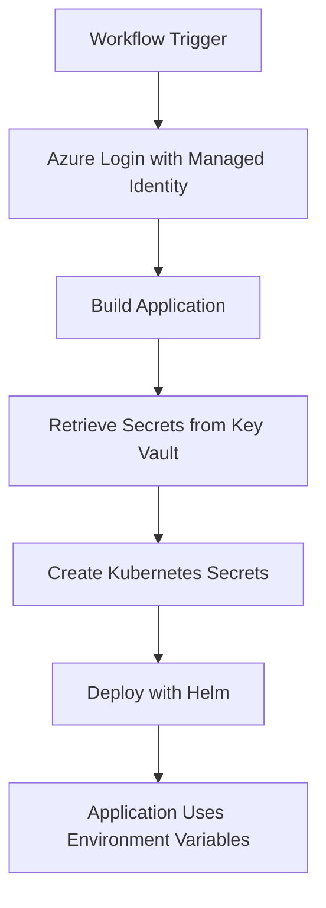

# Azure Key Vault Integration Summary

## Overview

This document summarizes the Azure Key Vault integration added to the CI/CD pipeline for secure management of application secrets, database credentials, third-party API tokens, and other sensitive configuration data.

## 🚀 What Was Added

### 1. New GitHub Action: `keyvault-secrets`
**Location**: `.github/actions/keyvault-secrets/action.yml`

**Features**:
- Retrieves secrets from Azure Key Vault using managed identity
- Supports environment-specific secret patterns
- Creates Kubernetes secrets automatically
- Handles base64 encoding for special characters
- Provides comprehensive error handling and validation

**Secret Patterns Supported**:
- Database credentials (`db-username`, `db-password`, `db-host`, etc.)
- Application secrets (`jwt-secret`, `encryption-key`, `api-key`)
- Third-party integrations (`external-api-url`, `external-api-token`)
- Storage credentials (`storage-account-key`, `storage-connection-string`)
- Messaging services (`redis-connection-string`, `servicebus-connection-string`)
- Monitoring tools (`appinsights-key`, `logging-connection-string`)

### 2. Updated Workflows

#### Shared Deployment Workflow
**File**: `.github/workflows/shared-deploy.yml`
- Added `KEYVAULT_NAME` secret requirement
- Integrated Key Vault secrets retrieval in deploy job
- Passes secrets to Helm deployment

#### Application Workflows
**Files**: 
- `.github/workflows/deploy-java-app.yml`
- `.github/workflows/deploy-nodejs-app.yml`

**Changes**:
- Added `KEYVAULT_NAME` secret to both workflows
- Enables Key Vault integration for all application deployments

### 3. Enhanced Helm Deployment

#### Updated Helm Deploy Action
**File**: `.github/actions/helm-deploy/action.yml`

**New Features**:
- Accepts secrets file from Key Vault action
- Creates Kubernetes secrets from Key Vault data
- Updates Helm values to reference Key Vault secrets
- Configures `envFrom` for automatic environment variable injection
- Provides detailed deployment summaries including secret information

### 4. Management Tools

#### Key Vault Management Script
**File**: `scripts/manage-keyvault-secrets.sh`

**Capabilities**:
- Add application secrets for specific environments
- List existing secrets by application and environment
- Update individual secrets
- Delete secrets with confirmation
- Generate random secrets for development
- Export secrets to environment files
- Verify Key Vault access permissions

**Usage Examples**:
```bash
# Add secrets for java-app in dev environment
./scripts/manage-keyvault-secrets.sh add-app-secrets -k mykeyvault -a java-app -e dev

# List secrets for java-app in prod environment
./scripts/manage-keyvault-secrets.sh list-app-secrets -k mykeyvault -a java-app -e production

# Update a specific secret
./scripts/manage-keyvault-secrets.sh update-secret -k mykeyvault -s java-app-dev-db-password -v newpassword

# Generate random secrets
./scripts/manage-keyvault-secrets.sh generate-secrets -k mykeyvault -a nodejs-app -e staging
```

#### Enhanced Verification Script
**File**: `scripts/verify-managed-identity.sh`

**New Features**:
- Tests Key Vault access permissions
- Verifies secret read/write capabilities
- Creates and cleans up test secrets
- Provides comprehensive permission validation

### 5. Documentation

#### Key Vault Integration Guide
**File**: `AZURE_KEYVAULT_INTEGRATION.md`

**Contents**:
- Complete setup instructions
- Secret naming conventions
- Application integration examples
- Security best practices
- Troubleshooting guide
- Migration procedures

#### Application Configuration Examples
**File**: `examples/application-config-with-keyvault.yml`

**Includes**:
- Spring Boot configuration examples
- Node.js configuration examples
- Helm chart value configurations
- Kubernetes deployment templates
- Docker Compose for local development
- Environment variable reference

## 🔧 Required Setup

### 1. Azure Key Vault Creation

```bash
# Create Key Vault with RBAC authorization
az keyvault create \
  --name "your-keyvault-name" \
  --resource-group "your-resource-group" \
  --location "eastus" \
  --enable-rbac-authorization true
```

### 2. Managed Identity Permissions

The managed identity needs the following role on the Key Vault:
```bash
az role assignment create \
  --role "Key Vault Secrets User" \
  --assignee "managed-identity-object-id" \
  --scope "/subscriptions/{sub}/resourceGroups/{rg}/providers/Microsoft.KeyVault/vaults/{kv}"
```

### 3. Repository Secret

Add to GitHub repository secrets:
- `KEYVAULT_NAME`: Your Azure Key Vault name

### 4. Populate Key Vault

Use the management script or Azure CLI:
```bash
# Using the management script
./scripts/manage-keyvault-secrets.sh add-app-secrets -k mykeyvault -a java-app -e dev

# Using Azure CLI directly
az keyvault secret set --vault-name mykeyvault --name "java-app-dev-db-password" --value "secure-password"
```

## 🔐 Secret Naming Convention

All secrets follow the pattern: `{application-name}-{environment}-{secret-type}`

**Examples**:
- `java-app-dev-db-username`
- `java-app-prod-jwt-secret`
- `nodejs-app-staging-external-api-token`
- `dev-shared-secret` (environment-wide secrets)

## 🏗️ How It Works

### 1. CI/CD Pipeline Flow



### 2. Secret Injection Process

1. **Key Vault Retrieval**: GitHub action fetches secrets using managed identity
2. **Pattern Matching**: Secrets are retrieved based on naming patterns
3. **Kubernetes Secret Creation**: Secrets are converted to Kubernetes secret objects
4. **Environment Variable Injection**: Helm configures `envFrom` to inject secrets as environment variables
5. **Application Access**: Applications access secrets through standard environment variables

### 3. Environment Variable Mapping

Key Vault secrets are automatically converted to environment variables:
- `java-app-dev-db-username` → `JAVA_APP_DEV_DB_USERNAME`
- `nodejs-app-prod-jwt-secret` → `NODEJS_APP_PROD_JWT_SECRET`

## 💡 Application Integration

### Spring Boot Example
```yaml
spring:
  datasource:
    url: jdbc:postgresql://${JAVA_APP_DEV_DB_HOST}:${JAVA_APP_DEV_DB_PORT}/${JAVA_APP_DEV_DB_NAME}
    username: ${JAVA_APP_DEV_DB_USERNAME}
    password: ${JAVA_APP_DEV_DB_PASSWORD}

jwt:
  secret: ${JAVA_APP_DEV_JWT_SECRET}
```

### Node.js Example
```javascript
module.exports = {
  database: {
    host: process.env.NODEJS_APP_DEV_DB_HOST,
    username: process.env.NODEJS_APP_DEV_DB_USERNAME,
    password: process.env.NODEJS_APP_DEV_DB_PASSWORD
  },
  jwt: {
    secret: process.env.NODEJS_APP_DEV_JWT_SECRET
  }
};
```

## 🛡️ Security Benefits

### Before (Credential-based)
- ❌ Service principal credentials stored as GitHub secrets
- ❌ ACR username/password authentication
- ❌ Secrets scattered across workflow files
- ❌ Manual credential rotation required

### After (Key Vault + Managed Identity)
- ✅ No stored credentials in GitHub
- ✅ Centralized secret management in Key Vault
- ✅ Managed identity authentication
- ✅ Automatic credential rotation capabilities
- ✅ Comprehensive audit trail
- ✅ Environment-specific secret isolation

## 🔍 Verification

### Test Your Setup
```bash
# Verify managed identity and Key Vault access
./scripts/verify-managed-identity.sh

# Test Key Vault management
./scripts/manage-keyvault-secrets.sh verify-access -k your-keyvault-name
```

### Monitoring
- Azure Activity Logs for Key Vault access
- GitHub Actions logs for secret retrieval
- Kubernetes secret status in deployments

## 📚 Additional Resources

- **Setup Guide**: `AZURE_KEYVAULT_INTEGRATION.md`
- **Managed Identity Migration**: `MANAGED_IDENTITY_MIGRATION.md`
- **Configuration Examples**: `examples/application-config-with-keyvault.yml`
- **Management Scripts**: `scripts/manage-keyvault-secrets.sh`
- **Verification Tool**: `scripts/verify-managed-identity.sh`

## 🚀 Next Steps

1. **Setup Infrastructure**: Create Key Vault and configure managed identity
2. **Add Repository Secret**: Add `KEYVAULT_NAME` to GitHub secrets
3. **Populate Secrets**: Use management script to add application secrets
4. **Update Applications**: Modify application configuration to use environment variables
5. **Test Deployment**: Run a test deployment to verify integration
6. **Monitor and Maintain**: Set up monitoring and establish secret rotation procedures

## 🔄 Migration Path

For existing applications:
1. Audit current hardcoded secrets
2. Add secrets to Key Vault using naming convention
3. Update application configuration files
4. Test in development environment
5. Deploy to staging and production
6. Remove hardcoded secrets from codebase

This integration provides a secure, scalable, and maintainable approach to secret management across all environments.