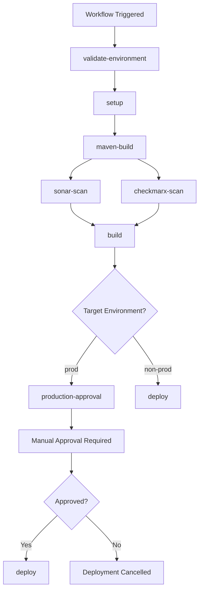

# Production Approval Gate Documentation

## 🎯 Overview

The **Production Approval Gate** is a critical security and compliance control that enforces manual approval for all production deployments. It acts as a final checkpoint to ensure human oversight before deploying to production environments.

## 🛡️ Purpose and Benefits

### **Primary Purposes**
1. **Human Oversight**: Ensures production deployments are reviewed by authorized personnel
2. **Quality Assurance**: Validates that all automated quality gates have passed
3. **Compliance**: Meets regulatory requirements for production deployment controls
4. **Risk Mitigation**: Provides a final safety check before production changes
5. **Audit Trail**: Creates documented approval records for compliance

### **Key Benefits**
- **Prevents Accidental Deployments**: Blocks automatic production deployments
- **Enforces Quality Standards**: Requires all scans to pass before approval
- **Maintains Compliance**: Satisfies enterprise governance requirements
- **Provides Visibility**: Displays comprehensive deployment information
- **Enables Rollback**: Allows cancellation before actual deployment

## 🏗️ How It Works

### **Job Architecture**
```yaml
production-approval:
  runs-on: ubuntu-latest
  needs: [validate-environment, setup, sonar-scan, checkmarx-scan, build]
  if: <complex-condition>
  environment: 
    name: production-approval
    url: https://github.com/${{ github.repository }}/actions/runs/${{ github.run_id }}
  steps:
    - name: 🛡️ Production Deployment Approval Required
```

### **Execution Flow**


## 🔍 Detailed Implementation

### **1. Job Dependencies**
```yaml
needs: [validate-environment, setup, sonar-scan, checkmarx-scan, build]
```

**Dependency Chain:**
- `validate-environment`: Environment validation and cluster configuration
- `setup`: Application metadata and versioning
- `sonar-scan`: Code quality and security scanning
- `checkmarx-scan`: Static application security testing
- `build`: Docker image build and push

### **2. Execution Conditions**
```yaml
if: |
  needs.validate-environment.outputs.should_deploy == 'true' && 
  needs.setup.outputs.should_deploy == 'true' && 
  needs.sonar-scan.outputs.scan_status == 'PASSED' && 
  needs.checkmarx-scan.outputs.scan_status == 'PASSED' && 
  needs.validate-environment.outputs.target_environment == 'prod' && 
  !failure() && !cancelled()
```

**Condition Breakdown:**

| Condition | Purpose | Required Value |
|-----------|---------|----------------|
| `validate-environment.should_deploy` | Environment validation passed | `'true'` |
| `setup.should_deploy` | Setup completed successfully | `'true'` |
| `sonar-scan.scan_status` | Code quality scan passed | `'PASSED'` |
| `checkmarx-scan.scan_status` | Security scan passed | `'PASSED'` |
| `target_environment` | Only for production | `'prod'` |
| `!failure() && !cancelled()` | No job failures or cancellations | `true` |

### **3. GitHub Environment Protection**
```yaml
environment: 
  name: production-approval
  url: https://github.com/${{ github.repository }}/actions/runs/${{ github.run_id }}
```

**Environment Configuration:**
- **Name**: `production-approval` - Dedicated environment for approval
- **URL**: Links to the current workflow run for context
- **Protection Rules**: Configured in GitHub repository settings

### **4. Approval Information Display**
```bash
echo "🚨 PRODUCTION DEPLOYMENT APPROVAL REQUIRED 🚨"
echo "📋 Deployment Details:"
echo "   Application: ${{ needs.setup.outputs.application_name }}"
echo "   Version: ${{ needs.setup.outputs.version }}"
echo "   Image Tag: ${{ needs.setup.outputs.image_tag }}"
echo "   Environment: ${{ needs.validate-environment.outputs.target_environment }}"
echo "   AKS Cluster: ${{ needs.validate-environment.outputs.aks_cluster_name_1 }}"
echo "✅ Quality Gates Status:"
echo "   SonarQube: ${{ needs.sonar-scan.outputs.scan_status }}"
echo "   Checkmarx: ${{ needs.checkmarx-scan.outputs.scan_status }}"
```

## ⚙️ GitHub Environment Configuration

### **1. Create Production Approval Environment**

**Navigate to**: Repository → Settings → Environments

**Environment Setup:**
```yaml
Environment Name: production-approval
Protection Rules:
  ✅ Required reviewers: 2-6 reviewers
  ✅ Reviewers: 
    - @your-org/platform-team
    - @your-org/security-team
    - @your-org/release-team
  ✅ Wait timer: 0 minutes (optional)
  ✅ Deployment branches: No restrictions
  ❌ Prevent self-review: Recommended
  ✅ Required conversation resolution: Recommended
```

### **2. Configure Required Reviewers**

**Team-Based Reviewers (Recommended):**
- `@your-org/platform-team` - Platform engineers and architects
- `@your-org/security-team` - Security engineers and compliance officers
- `@your-org/release-team` - Release managers and deployment approvers

**Individual Reviewers (Alternative):**
- Platform architects
- Security engineers  
- Release managers
- DevOps leads

### **3. Deployment Branch Restrictions**
```yaml
Deployment Branches: No restrictions
# Note: Branch validation is handled by the workflow logic
# This allows emergency deployments with proper authorization
```

## 🚦 Quality Gate Integration

### **Quality Gates Required for Approval**

#### **1. SonarQube Quality Gate**
```yaml
Scan Status: PASSED
Requirements:
  - Code coverage >= 80%
  - Reliability rating = A
  - Security rating = A  
  - Maintainability rating <= B
  - No blocker/critical issues
```

#### **2. Checkmarx Security Gate**
```yaml
Scan Status: PASSED
Requirements:
  - High severity vulnerabilities = 0
  - Medium severity vulnerabilities <= 5
  - Low severity vulnerabilities <= 10
  - No critical security flaws
```

#### **3. Build Validation Gate**
```yaml
Build Status: SUCCESS
Requirements:
  - Maven build successful
  - Docker image built and pushed
  - All tests passed
  - Artifacts created successfully
```

## 📋 Approval Process

### **1. Automatic Trigger**
```bash
# When all conditions are met:
✅ Target environment is 'prod'
✅ All quality gates passed
✅ Build completed successfully
✅ No job failures or cancellations

# The approval gate activates automatically
```

### **2. Manual Approval Steps**

**For Approvers:**
1. **Navigate** to the workflow run via notification or repository Actions tab
2. **Review** deployment details displayed in the approval job
3. **Verify** quality gate results:
   - SonarQube scan: `PASSED`
   - Checkmarx scan: `PASSED`
   - Build status: `SUCCESS`
4. **Check** deployment information:
   - Application name and version
   - Target environment and cluster
   - Image tag and build artifacts
5. **Make Decision**:
   - **Approve**: Allow deployment to proceed
   - **Reject**: Block deployment and require fixes

### **3. Approval Interface**
```
GitHub Environment Protection Interface:
┌─────────────────────────────────────────┐
│ 🛡️ production-approval environment     │
├─────────────────────────────────────────┤
│ 📋 Review requested                     │
│ 👥 Reviewers: @platform-team           │
│ 📊 Deployment Details:                 │
│   • Application: java-backend1         │
│   • Version: v1.2.3                    │
│   • Environment: prod                  │
│   • Quality Gates: ✅ PASSED           │
├─────────────────────────────────────────┤
│ [✅ Approve]  [❌ Reject]               │
└─────────────────────────────────────────┘
```

## 🔄 Integration with Deployment Job

### **Deploy Job Condition**
```yaml
deploy:
  needs: [validate-environment, setup, sonar-scan, checkmarx-scan, build, production-approval]
  if: |
    needs.validate-environment.outputs.should_deploy == 'true' && 
    needs.setup.outputs.should_deploy == 'true' && 
    needs.sonar-scan.outputs.scan_status == 'PASSED' && 
    needs.checkmarx-scan.outputs.scan_status == 'PASSED' && 
    !failure() && !cancelled() &&
    (
      needs.validate-environment.outputs.target_environment != 'prod' ||
      (needs.validate-environment.outputs.target_environment == 'prod' && needs.production-approval.result == 'success')
    )
```

### **Logic Explanation**
```bash
# For non-production environments:
if environment != 'prod':
    deploy_directly()

# For production environments:
if environment == 'prod':
    if production_approval.result == 'success':
        deploy_to_production()
    else:
        block_deployment()
```

## 📊 Approval Decision Matrix

### **Deployment Flow by Environment**

| Environment | Quality Gates | Approval Required | Direct Deploy | Manual Override |
|-------------|---------------|-------------------|---------------|-----------------|
| **DEV** | ❌ Optional | ❌ No | ✅ Yes | ✅ Yes |
| **SQE** | ✅ Required | ❌ No | ✅ Yes | ✅ Yes |
| **PPR** | ✅ Required | ❌ No | ✅ Yes | ✅ Authorized only |
| **PROD** | ✅ Required | ✅ **YES** | ❌ No | ✅ Emergency only |

### **Production Approval Requirements**

| Component | Status Required | Impact if Failed |
|-----------|----------------|------------------|
| **Environment Validation** | `should_deploy == 'true'` | Approval gate skipped |
| **Setup Job** | `should_deploy == 'true'` | Approval gate skipped |
| **SonarQube Scan** | `scan_status == 'PASSED'` | Approval gate blocked |
| **Checkmarx Scan** | `scan_status == 'PASSED'` | Approval gate blocked |
| **Build Job** | `success` | Approval gate blocked |
| **Manual Approval** | `approved` | Deployment blocked |

## 🚨 Emergency Deployment Process

### **Emergency Override Capability**
```yaml
# Emergency deployment still requires approval gate
# But provides expedited process for critical issues

Emergency Process:
1. Quality gates must still pass
2. Approval gate still activates  
3. Emergency contacts can approve
4. Deployment notes mandatory
5. Enhanced audit logging
```

### **Emergency Approval Configuration**
```yaml
# In repository environment settings
Emergency Reviewers:
  - @your-org/emergency-team
  - emergency-contact-1
  - emergency-contact-2

Wait Timer: 0 minutes (immediate approval possible)
Required Reviewers: 1 (reduced for emergencies)
```

## 📈 Monitoring and Reporting

### **Key Metrics to Track**
- **Approval Response Time**: Time from request to approval/rejection
- **Approval Success Rate**: Percentage of deployments approved
- **Quality Gate Pass Rate**: Percentage meeting quality standards
- **Rejection Reasons**: Common causes for deployment rejection
- **Emergency Deployment Frequency**: Usage of emergency processes

### **Audit Trail Information**
```yaml
Approval Record Includes:
  - Timestamp of approval request
  - Approver identity and team
  - Quality gate status at approval time
  - Deployment details (app, version, environment)
  - Approval decision and optional comments
  - Time to approval/rejection
```

## 🔧 Configuration Management

### **Customizable Parameters**

#### **1. Quality Gate Thresholds**
```yaml
# In repository variables
SONAR_COVERAGE_THRESHOLD: "80"
SONAR_RELIABILITY_RATING: "1"  # A rating
SONAR_SECURITY_RATING: "1"     # A rating
CHECKMARX_HIGH_THRESHOLD: "0"
CHECKMARX_MEDIUM_THRESHOLD: "5"
CHECKMARX_LOW_THRESHOLD: "10"
```

#### **2. Approval Requirements**
```yaml
# In environment protection settings
Required Reviewers: 2
Reviewers: 
  - @platform-team
  - @security-team
Wait Timer: 0 minutes
Prevent Self-Review: true
```

#### **3. Environment-Specific Configuration**
```yaml
# Different approval rules per environment
production-approval:
  required_reviewers: 2
  teams: ["platform-team", "security-team"]
  
emergency-approval:
  required_reviewers: 1
  teams: ["emergency-team"]
  wait_timer: 0
```

## 🎯 Best Practices

### **1. Approval Configuration**
- **Multiple Reviewers**: Require at least 2 approvers for production
- **Team-Based**: Use GitHub teams instead of individual users
- **Time Limits**: Set reasonable approval timeouts
- **Documentation**: Require approval comments for audit trail

### **2. Quality Gate Standards**
- **Strict Thresholds**: Set high quality standards for production
- **Security First**: Zero tolerance for critical security issues
- **Code Coverage**: Maintain high test coverage requirements
- **Performance**: Include performance testing in quality gates

### **3. Emergency Procedures**
- **Clear Escalation**: Define emergency approval contacts
- **Rapid Response**: Minimize approval time for critical issues
- **Enhanced Logging**: Increase audit detail for emergency deployments
- **Post-Deployment Review**: Mandatory review of emergency deployments

### **4. Monitoring and Alerting**
- **Approval Notifications**: Alert teams when approval needed
- **Quality Gate Failures**: Immediate notification of gate failures
- **Deployment Status**: Real-time deployment progress updates
- **Audit Reports**: Regular review of approval patterns and metrics

## 🚀 Implementation Checklist

### **Repository Configuration**
- [ ] Create `production-approval` environment
- [ ] Configure required reviewers (teams/individuals)
- [ ] Set appropriate wait timers
- [ ] Enable conversation resolution requirements
- [ ] Test approval interface

### **Quality Gate Setup**
- [ ] Configure SonarQube quality profile
- [ ] Set Checkmarx security thresholds
- [ ] Define build validation criteria
- [ ] Test quality gate integration
- [ ] Validate failure scenarios

### **Team Preparation**
- [ ] Train approval teams on process
- [ ] Document emergency procedures
- [ ] Set up notification channels
- [ ] Define escalation paths
- [ ] Create approval checklists

### **Testing and Validation**
- [ ] Test approval flow with non-prod deployment
- [ ] Validate quality gate blocking
- [ ] Test approval rejection scenarios
- [ ] Verify emergency override process
- [ ] Validate audit trail creation

## 📚 Additional Resources

### **Related Documentation**
- [Deployment Security Guide](DEPLOYMENT_SECURITY_GUIDE.md)
- [GitHub Enterprise Configuration](GITHUB_ENTERPRISE_CONFIGURATION.md)
- [Branching and Tagging Validation](BRANCHING_TAGGING_VALIDATION_REPORT.md)
- [Team Integration Guide](TEAM_INTEGRATION_GUIDE.md)

### **GitHub Documentation**
- [GitHub Environments](https://docs.github.com/en/actions/deployment/targeting-different-environments/using-environments-for-deployment)
- [Environment Protection Rules](https://docs.github.com/en/actions/deployment/targeting-different-environments/using-environments-for-deployment#environment-protection-rules)
- [Required Reviewers](https://docs.github.com/en/actions/deployment/targeting-different-environments/using-environments-for-deployment#required-reviewers)

## 🎉 Summary

The **Production Approval Gate** provides enterprise-grade deployment control through:

- **🛡️ Mandatory Manual Approval**: Human oversight for all production deployments
- **📊 Quality Gate Integration**: Automated validation of code quality and security
- **👥 Team-Based Authorization**: Configurable approval teams and individuals  
- **🔍 Complete Visibility**: Comprehensive deployment information display
- **📝 Audit Trail**: Full documentation of approval decisions
- **🚨 Emergency Support**: Expedited approval for critical deployments

This system ensures that production deployments meet the highest standards of quality, security, and governance while maintaining the flexibility needed for emergency responses.