# 🚀 Java Backend1 - Blue-Green Deployment Pipeline

Enterprise-grade Java Spring Boot microservice with comprehensive Blue-Green deployment strategy using GitHub Actions, Azure Kubernetes Service (AKS), and Helm.

## 📋 **Quick Start**

```bash
# 🏗️ 1. Set up Azure Infrastructure
./scripts/azure-setup.sh

# ⚓ 2. Deploy to Development
./scripts/deploy.sh -e dev

# 🔵🟢 3. Deploy to Production (Blue-Green)
./scripts/deploy.sh -e prod -s green

# ✅ 4. Monitor Deployment
./scripts/monitor-deployment.sh prod
```

## 🎯 **Project Overview**

### **Deployment Strategy**
| Environment | Strategy | Approval | Rollback Time | Zero Downtime |
|-------------|----------|----------|---------------|---------------|
| **Dev** | Rolling | Auto | ~2 minutes | ❌ |
| **SQE** | Rolling | Auto | ~3 minutes | ❌ |
| **PPR** | Blue-Green | Auto | <30 seconds | ✅ |
| **Prod** | Blue-Green | Manual | <30 seconds | ✅ |

### **Architecture Components**
- **🏗️ Azure Infrastructure**: ACR, AKS clusters, Key Vault, Monitoring
- **⚓ Kubernetes Orchestration**: Helm charts with Blue-Green support
- **🔄 CI/CD Pipeline**: GitHub Actions with quality gates
- **🔐 Security**: Azure OIDC, Key Vault integration, RBAC
- **📊 Monitoring**: Application Insights, Prometheus, structured logging

## 📚 **Complete Documentation**

### **🏗️ Infrastructure Setup**
- **[Azure Infrastructure Setup](docs/AZURE-INFRASTRUCTURE-SETUP.md)** - Complete Azure environment setup
  - Resource groups, ACR, AKS clusters for all environments
  - Azure Key Vault configuration and secret management
  - Service Principal and OIDC federation setup
  - GitHub secrets and variables configuration
  - Network security, monitoring, and cost optimization
  - Step-by-step validation and testing procedures

### **☕ Application Configuration**
- **[Spring Boot Configuration](docs/SPRING-BOOT-CONFIGURATION.md)** - Comprehensive application setup
  - Environment-specific profiles (local, dev, sqe, ppr, prod)
  - Azure Key Vault integration with secret injection
  - Database configuration with connection pooling
  - Security configuration with JWT and CORS
  - Health checks, logging, caching, and performance optimization
  - Blue-Green deployment support with slot awareness

### **🔄 Rollback Procedures**
- **[Rollback Procedures](docs/ROLLBACK-PROCEDURES.md)** - Emergency recovery procedures
  - Environment-specific rollback strategies
  - Rolling deployment rollback for dev/sqe environments
  - Blue-Green traffic switch rollback for ppr/prod environments
  - Database rollback procedures and data consistency
  - Automated rollback scripts and smart decision making
  - Post-rollback analysis and prevention best practices

### **⚓ Helm Integration**
- **[Helm Integration Guide](docs/HELM-INTEGRATION-GUIDE.md)** - Complete Helm chart management
  - Comprehensive chart structure with Blue-Green templates
  - Environment-specific values configuration
  - Helper templates for reusable components
  - Blue-Green deployment support with namespace isolation
  - Testing, validation, and troubleshooting procedures
  - Operational best practices and command references

### **🚀 Deployment Operations**
- **[Deployment Guide](DEPLOYMENT.md)** - Deployment procedures and workflows
- **[Quick Reference](docs/QUICK-REFERENCE.md)** - Essential commands and troubleshooting

## 🏗️ **Infrastructure Overview**

### **Azure Resources Created**
```yaml
Resource Groups:
  - rg-java-backend1-dev     # Development resources
  - rg-java-backend1-sqe     # SQE testing resources  
  - rg-java-backend1-ppr     # Pre-production resources
  - rg-java-backend1-prod    # Production resources
  - rg-java-backend1-shared  # Shared services (ACR)

AKS Clusters:
  - aks-java-backend1-dev    # Development cluster
  - aks-java-backend1-sqe    # SQE testing cluster
  - aks-java-backend1-ppr    # Pre-production cluster
  - aks-java-backend1-prod   # Production cluster

Key Vaults:
  - java-backend1-kv-dev     # Development secrets
  - java-backend1-kv-sqe     # SQE secrets
  - java-backend1-kv-ppr     # Pre-production secrets
  - java-backend1-kv-prod    # Production secrets

Container Registry:
  - javabackend1registry     # Shared ACR for all environments
```

### **Namespace Strategy (Blue-Green)**
```yaml
Development/SQE: default namespace (rolling deployment)
Pre-Production:
  - ppr-java-backend1-blue   # Blue slot namespace
  - ppr-java-backend1-green  # Green slot namespace
  - default                  # Main ingress for traffic routing

Production:
  - prod-java-backend1-blue  # Blue slot namespace
  - prod-java-backend1-green # Green slot namespace
  - default                  # Main ingress for traffic routing
```

## 🔄 **Deployment Workflow**

### **Automated CI/CD Pipeline**

```mermaid
graph LR
    A[Code Push] --> B[Quality Gates]
    B --> C[Build & Test]
    C --> D[Security Scan]
    D --> E[Dev Deployment]
    E --> F[SQE Deployment]
    F --> G[PPR Blue-Green]
    G --> H[Manual Approval]
    H --> I[Prod Blue-Green]
    I --> J[Health Validation]
    J --> K[Traffic Switch]
```


### **Quality Gates**
- **✅ SonarQube**: Code quality, coverage (>80%), security hotspots
- **✅ Checkmarx**: Security vulnerability scanning
- **✅ Unit Tests**: Automated testing with coverage reports
- **✅ Integration Tests**: API and database connectivity tests
- **✅ Health Checks**: Application startup and readiness validation

## 🔵🟢 **Blue-Green Deployment**

### **How It Works**
1. **Deploy to Inactive Slot**: New version deployed to blue/green namespace
2. **Health Validation**: Automated health checks and smoke tests
3. **Traffic Switch**: Instant traffic redirection via ingress update
4. **Rollback Ready**: Previous slot maintained for instant rollback

### **Traffic Routing**
```yaml
Production Traffic Flow:
  Client → Azure Application Gateway (SSL termination) → NGINX Ingress (HTTP) → Active Slot Namespace
  
Pre-Production Traffic Flow:
  Client → Azure Application Gateway (SSL termination) → NGINX Ingress (HTTP) → Active Slot Namespace

Architecture:
  - Azure Application Gateway: SSL termination, WAF protection
  - NGINX Ingress: HTTP routing, Blue-Green traffic switching
  - Namespaces: Blue/Green slot isolation

Slot Determination:
  - Blue Slot: prod-java-backend1-blue namespace
  - Green Slot: prod-java-backend1-green namespace
  - Active slot tracked via ingress label: active-slot=blue|green
```

## 🛠️ **Development Workflow**

### **Local Development**
```bash
# Start local development
mvn spring-boot:run -Dspring.profiles.active=local

# Run with Docker
docker build -t java-backend1:local .
docker run -p 8080:8080 java-backend1:local
```

### **Environment Promotion**
```bash
# Development
git push origin develop → Auto deploy to dev

# SQE Testing  
git push origin main → Auto deploy to sqe

# Pre-Production
./scripts/deploy.sh -e ppr → Blue-Green deployment

# Production
./scripts/deploy.sh -e prod → Manual approval + Blue-Green
```

## 📊 **Monitoring & Observability**

### **Health Endpoints**
- **Application Health**: `/backend1/actuator/health`
- **Liveness Probe**: `/backend1/actuator/health/liveness`
- **Readiness Probe**: `/backend1/actuator/health/readiness`
- **Metrics**: `/backend1/actuator/prometheus`
- **Deployment Info**: `/backend1/api/deployment/info`

### **Monitoring Stack**
- **Application Insights**: Application performance monitoring
- **Prometheus**: Metrics collection and alerting
- **Azure Monitor**: Infrastructure and cluster monitoring
- **Log Analytics**: Centralized log aggregation
- **Structured Logging**: JSON logs with correlation IDs

## 🔐 **Security Features**

### **Authentication & Authorization**
- **Azure OIDC**: Workload identity for GitHub Actions
- **Service Principal**: Least privilege access to Azure resources
- **RBAC**: Role-based access control for Kubernetes resources

### **Secret Management**
- **Azure Key Vault**: Centralized secret storage
- **Environment Isolation**: Separate Key Vaults per environment
- **Secret Injection**: Runtime secret mounting in pods
- **Secret Rotation**: Automated secret lifecycle management

### **Container Security**
- **Non-root User**: Containers run with limited privileges
- **Read-only Filesystem**: Immutable container runtime
- **Security Scanning**: Automated vulnerability detection
- **Network Policies**: Pod-to-pod communication restrictions

## 🚀 **Quick Commands**

### **Deployment**
```bash
# Deploy to development
./scripts/deploy.sh -e dev

# Deploy to production with specific image
./scripts/deploy.sh -e prod -i v1.2.3 -s green

# Force deployment (skip validations)
./scripts/deploy.sh -e ppr -f
```

### **Monitoring**
```bash
# Check deployment health
./scripts/health-check.sh prod

# Monitor deployment progress
./scripts/monitor-deployment.sh ppr

# View real-time logs
kubectl logs -f deployment/java-backend1 -n prod-java-backend1-blue
```

### **Rollback**
```bash
# Emergency rollback
./scripts/emergency-rollback.sh prod

# Helm rollback to previous version
helm rollback java-backend1 -n default

# Blue-Green traffic switch
kubectl patch ingress java-backend1-ingress -n default --type='merge' -p='{"metadata":{"labels":{"active-slot":"blue"}}}'
```

## 🔧 **Troubleshooting**

### **Common Issues**
| Issue | Symptoms | Solution |
|-------|----------|----------|
| **Pod CrashLoop** | Pods constantly restarting | Check health endpoints, resource limits |
| **Traffic Not Switching** | Old version still serving | Verify ingress configuration, DNS propagation |
| **Database Connection** | 500 errors, timeout | Check Key Vault secrets, network policies |
| **Image Pull Errors** | ImagePullBackOff status | Verify ACR credentials, image tags |

### **Debug Commands**
```bash
# Check pod status
kubectl get pods -n prod-java-backend1-blue -o wide

# View pod logs
kubectl logs deployment/java-backend1 -n prod-java-backend1-blue --tail=100

# Check ingress configuration
kubectl get ingress java-backend1-ingress -n default -o yaml

# Test connectivity
kubectl exec -it deployment/java-backend1 -n prod-java-backend1-blue -- curl localhost:8080/backend1/actuator/health
```

## 🤝 **Contributing**

### **Development Process**
1. **Fork** the repository
2. **Create** feature branch (`git checkout -b feature/amazing-feature`)
3. **Commit** changes (`git commit -m 'Add amazing feature'`)
4. **Push** to branch (`git push origin feature/amazing-feature`)
5. **Open** Pull Request

### **Code Standards**
- **Java 21** with Spring Boot 3.2+
- **SonarQube** quality gates (>80% coverage)
- **Checkmarx** security scanning
- **Conventional Commits** for clear history
- **Documentation** for all public APIs

## 📞 **Support**

### **Documentation**
- **[Azure Infrastructure Setup](docs/AZURE-INFRASTRUCTURE-SETUP.md)** - Complete infrastructure guide
- **[Spring Boot Configuration](docs/SPRING-BOOT-CONFIGURATION.md)** - Application configuration
- **[Rollback Procedures](docs/ROLLBACK-PROCEDURES.md)** - Emergency procedures
- **[Helm Integration Guide](docs/HELM-INTEGRATION-GUIDE.md)** - Helm chart management
- **[Deployment Guide](DEPLOYMENT.md)** - Deployment workflows
- **[Quick Reference](docs/QUICK-REFERENCE.md)** - Command reference

### **Getting Help**
- **🎫 Issues**: [GitHub Issues](https://github.com/your-org/java-backend1/issues)
- **💬 Discussions**: [GitHub Discussions](https://github.com/your-org/java-backend1/discussions)
- **📧 Email**: devops@yourcompany.com
- **📱 Slack**: #java-backend1-support

## 📄 **License**

This project is licensed under the MIT License - see the [LICENSE](LICENSE) file for details.

---

**🎯 Ready for Production!** This implementation provides enterprise-grade Blue-Green deployment with zero-downtime releases, comprehensive monitoring, and robust rollback capabilities.
