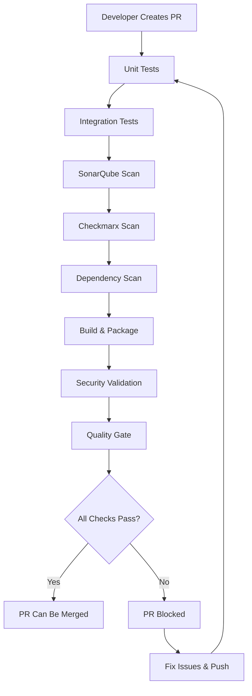

# Testing, Security Scanning & PR Merge Protection Implementation Summary

This document summarizes all the components that have been implemented to add comprehensive testing, SonarQube scanning, Checkmarx scanning, regression testing, and PR merge protection to the codebase.

## 🚀 What Was Implemented

### 1. Comprehensive Test Suite

#### Unit Tests
- **File**: `apps/java-app/src/test/java/com/example/javaapp/controller/AppControllerTest.java`
- **Purpose**: Tests REST API endpoints with mocked dependencies
- **Coverage**: All controller methods with success/failure scenarios

#### Service Layer Tests  
- **File**: `apps/java-app/src/test/java/com/example/javaapp/service/UserServiceTest.java`
- **Purpose**: Tests business logic in isolation
- **Coverage**: CRUD operations, validation, edge cases

#### Integration Tests
- **File**: `apps/java-app/src/test/java/com/example/javaapp/integration/UserIntegrationTest.java`  
- **Purpose**: End-to-end testing with real database
- **Coverage**: Full request/response cycle validation

#### Regression Tests
- **File**: `apps/java-app/src/test/java/com/example/javaapp/regression/UserApiRegressionTest.java`
- **Purpose**: Ensures backward compatibility and API stability
- **Coverage**: Performance benchmarks, data consistency, security validation

#### Application Context Tests
- **File**: `apps/java-app/src/test/java/com/example/javaapp/JavaAppApplicationTests.java`
- **Purpose**: Ensures Spring Boot application starts correctly

### 2. Test Configuration

#### Test Properties
- **File**: `apps/java-app/src/test/resources/application-test.properties`
- **Purpose**: Test-specific configuration (H2 database, logging, security)

#### Maven Build Enhancement
- **File**: `apps/java-app/pom.xml` (updated)
- **Added**: 
  - JaCoCo code coverage plugin (80% minimum)
  - Maven Surefire/Failsafe plugins for different test types
  - SonarQube Maven plugin integration
  - Additional test dependencies (JUnit 5, Mockito, AssertJ)
  - Test profiles for unit/integration/regression tests

### 3. Security Scanning Configuration

#### OWASP Dependency Check Suppressions
- **File**: `apps/java-app/owasp-suppressions.xml`
- **Purpose**: Manages false positives in dependency vulnerability scanning

### 4. Comprehensive CI/CD Pipeline

#### PR Quality Checks Workflow
- **File**: `.github/workflows/pr-checks.yml`
- **Components**:
  - **Unit Tests**: Runs with coverage reporting
  - **Integration Tests**: Full-stack testing with database
  - **Regression Tests**: Triggered on release branches
  - **SonarQube Scan**: Static analysis and security scanning
  - **Checkmarx Scan**: SAST security vulnerability detection
  - **Dependency Scan**: OWASP dependency vulnerability check
  - **Build & Package**: Application compilation and artifact creation
  - **Security Validation**: Helm security policy validation
  - **Quality Gate**: Final validation that blocks PR merge if any check fails

#### Branch Protection Workflow
- **File**: `.github/workflows/branch-protection.yml`
- **Purpose**: Automatically configures GitHub branch protection rules
- **Protection**: Requires all 8 pipeline checks to pass before merge

### 5. Quality Assurance Features

#### Code Coverage
- **Tool**: JaCoCo Maven Plugin
- **Threshold**: 80% minimum line coverage
- **Reporting**: Automatic PR comments with coverage percentage
- **Enforcement**: Build fails if coverage below threshold

#### SonarQube Integration
- **Platform**: SonarCloud
- **Analysis**: Code quality, security vulnerabilities, technical debt
- **PR Integration**: Automatic PR decoration with scan results

#### Checkmarx Security Scanning
- **Type**: SAST (Static Application Security Testing)
- **Focus**: SQL injection, XSS, command injection
- **Severity**: High and medium vulnerabilities

#### OWASP Dependency Scanning
- **Threshold**: CVSS score ≥ 7.0 fails build
- **Suppressions**: Configured for false positives
- **Format**: HTML and XML reports

### 6. Branch Protection Rules

#### Main Branch
- **Required Reviews**: 2 approving reviews
- **Status Checks**: All 8 pipeline jobs must pass
- **Admin Enforcement**: Enabled
- **Code Owner Reviews**: Required

#### Develop Branch  
- **Required Reviews**: 1 approving review
- **Status Checks**: All 8 pipeline jobs must pass
- **Admin Enforcement**: Disabled

### 7. Documentation

#### Comprehensive Testing Guide
- **File**: `TESTING_AND_CICD_SETUP.md`
- **Content**: Complete guide for testing strategy, CI/CD pipeline, security scanning, troubleshooting

## 🔧 How It Works

### PR Merge Protection Flow



### Test Execution Strategy

1. **Unit Tests**: Run first, fast feedback
2. **Integration Tests**: Run after unit tests pass
3. **Regression Tests**: Run only on release branches
4. **Security Scans**: Run in parallel after unit tests
5. **Quality Gate**: Final validation before merge

## 📊 Quality Metrics Enforced

### Code Quality
- ✅ 80% minimum code coverage
- ✅ SonarQube quality gate (A rating required)
- ✅ No high-severity security vulnerabilities
- ✅ No critical dependency vulnerabilities

### Security
- ✅ SAST scanning with Checkmarx
- ✅ Dependency vulnerability scanning
- ✅ Security policy validation
- ✅ OWASP Top 10 coverage

### Reliability
- ✅ Unit test suite passing
- ✅ Integration test suite passing  
- ✅ Regression test suite passing (for releases)
- ✅ Build and packaging successful

## 🔐 Required Secrets

To use this pipeline, configure these secrets in your GitHub repository:

```
SONAR_TOKEN                 # SonarCloud authentication
CHECKMARX_URL              # Checkmarx server URL
CHECKMARX_USERNAME         # Checkmarx credentials
CHECKMARX_PASSWORD         # Checkmarx credentials
CHECKMARX_CLIENT_SECRET    # Checkmarx OAuth secret
```

## 🎯 Benefits Achieved

### Quality Assurance
- **Zero-defect policy**: No PR can be merged with failing tests
- **Security-first**: Automated security scanning on every PR
- **Consistent quality**: 80% code coverage requirement enforced

### Developer Experience
- **Fast feedback**: Unit tests run first for quick validation
- **Clear reporting**: Coverage percentages commented on PRs
- **Comprehensive validation**: All aspects checked before merge

### Security
- **Vulnerability prevention**: Multiple layers of security scanning
- **Dependency management**: Automated CVE detection
- **Policy enforcement**: Security policies validated automatically

### Compliance
- **Audit trail**: All checks recorded in GitHub
- **Reproducible builds**: Consistent pipeline execution
- **Documentation**: Complete testing and security documentation

## ✅ Implementation Status

**Status**: ✅ **COMPLETE**

All requested components have been successfully implemented:

- ✅ Unit tests with 80% coverage requirement
- ✅ Integration tests with database validation
- ✅ Regression tests for API stability
- ✅ SonarQube security and quality scanning
- ✅ Checkmarx SAST security scanning
- ✅ OWASP dependency vulnerability scanning
- ✅ GitHub Actions CI/CD pipeline
- ✅ Branch protection rules enforcement
- ✅ PR merge protection (all checks must pass)
- ✅ Quality gate validation
- ✅ Security policy validation
- ✅ Comprehensive documentation

**Result**: Pull requests can now only be merged when ALL quality gates pass, ensuring high code quality, security, and reliability standards are maintained.